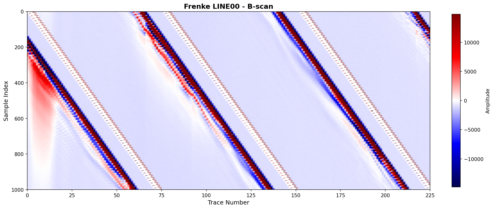
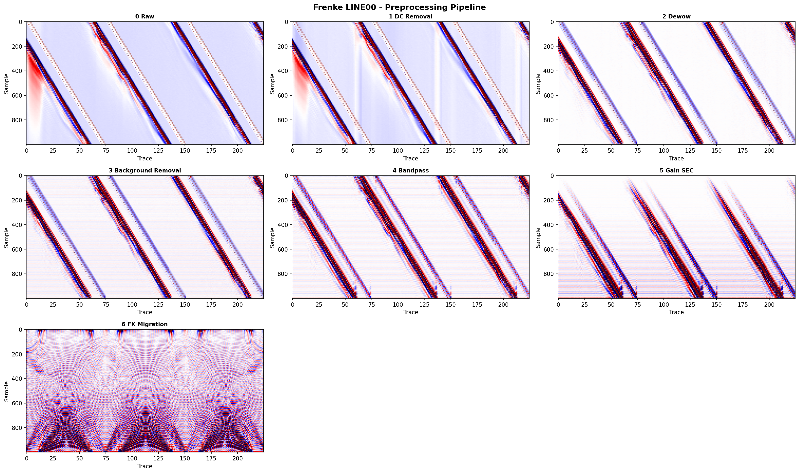
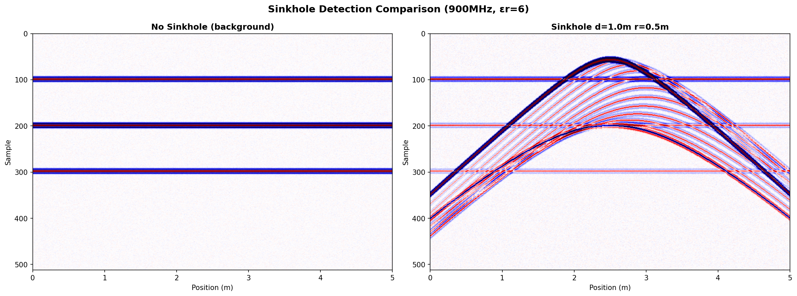
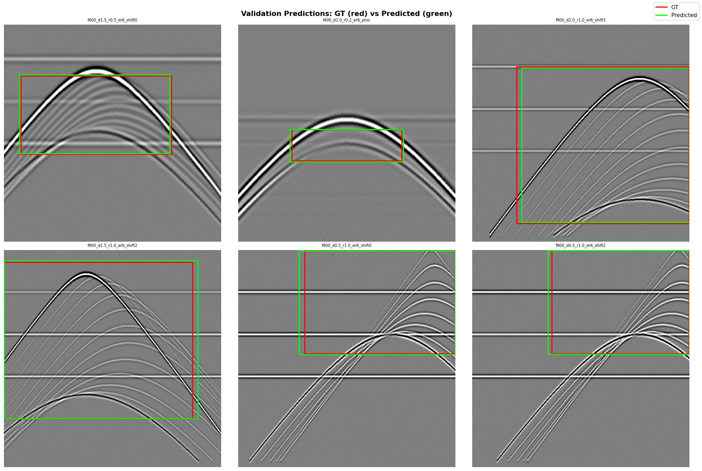

# GPR Sinkhole Detection

GPR(지중레이더) 데이터 처리부터 YOLOv11 기반 싱크홀 자동 탐지까지의 4주 실습 프로젝트.

## Overview

| 주차 | 주제 | 핵심 내용 |
|------|------|-----------|
| 1 | 데이터 수집 & 시각화 | DT1/DZT/IDS .dt 파서, B-scan 시각화 |
| 2 | 전처리 & DB | 6단계 파이프라인 (DC→Dewow→BGRemoval→Bandpass→Gain→Migration), SQLite |
| 3 | 오픈소스 분석 & 시뮬레이션 | GPRPy/gprMax/siina 비교, 해석적 합성 B-scan 48개 |
| 4 | 싱크홀 탐지 | YOLOv11n 학습, mAP50=0.995, 실제 데이터 zero-shot 추론 |

## Results

### YOLOv11 Sinkhole Detection (Week 4)

| Metric | Value |
|--------|-------|
| mAP50 | **0.995** |
| mAP50-95 | **0.974** |
| Precision | **0.999** |
| Recall | **1.000** |
| F1 | **0.999** |

- 264개 학습 이미지 (합성 B-scan 48개 + 위치 증강 + 전처리 증강)
- YOLOv11n (2.6M params), COCO pretrained, backbone freeze
- 학습 시간: 8.6분 (RTX 3060, 1.05GB VRAM)
- 실제 GPR 데이터 zero-shot 추론: False Positive 0건

### Sample Outputs

| B-scan 시각화 | 전처리 파이프라인 |
|:-:|:-:|
|  |  |

| 합성 시뮬레이션 | YOLO 탐지 결과 |
|:-:|:-:|
|  |  |

## Project Structure

```
├── src/
│   ├── week1_gpr_basics.py        # DT1/DZT/IDS .dt 파서 + B-scan 시각화
│   ├── week2_preprocessing.py     # 6단계 전처리 파이프라인
│   ├── week2_database.py          # SQLAlchemy ORM (Dataset/Run/Step)
│   ├── week3_analysis.py          # GPRPy/gprMax/siina 오픈소스 분석
│   ├── week3_simulation.py        # 싱크홀 합성 B-scan 생성
│   ├── week4_yolo_detection.py    # YOLOv11 데이터 준비 + 학습 + 평가
│   └── output/                    # 시각화 이미지 (22개)
├── data/gpr/
│   ├── synthetic/                 # 합성 B-scan 48세트 (.npy + _meta.json)
│   └── yolo_dataset/              # YOLO 포맷 (264 PNG + 라벨)
├── models/
│   ├── *.in                       # gprMax 시뮬레이션 파일 48개
│   └── yolo_runs/sinkhole_detect/ # 학습 결과 (best.pt, metrics)
├── db/gpr_processing.db           # SQLite (51 datasets, processing history)
└── gpr_env.yml                    # conda 환경 설정
```

## Datasets Used

| 데이터셋 | 포맷 | 출처 | 용도 |
|----------|------|------|------|
| Frenke | Sensors & Software DT1 | Public | 하천 퇴적층 B-scan |
| NSGeophysics | GSSI DZT | GitHub | 사구 탐사 |
| Tagliamento | DT1 | Zenodo 2586189 | 하천 단면 |
| Guangzhou | IDS .dt | Zenodo 14637589 | 파이프/철근/터널 (2GHz) |
| Synthetic | NumPy (.npy) | 자체 생성 | 싱크홀 시뮬레이션 48개 |

> 실측 데이터는 용량 문제로 이 저장소에 포함되지 않습니다. 위 출처에서 직접 다운로드하세요.

## Preprocessing Pipeline (Week 2)

```
Raw B-scan
 → DC Removal (trace mean subtraction)
 → Dewow (low-frequency trend removal)
 → Background Removal (mean trace subtraction)
 → Bandpass Filter (Butterworth, freq-adaptive)
 → SEC Gain (spreading & exponential compensation)
 → FK Migration (Stolt, velocity-based)
```

## Synthetic B-scan Parameters (Week 3)

해석적 합성: Ricker wavelet + diffraction hyperbola

| 파라미터 | 값 |
|----------|-----|
| 주파수 | 400, 900 MHz |
| 싱크홀 깊이 | 0.5, 1.0, 1.5, 2.0 m |
| 싱크홀 반경 | 0.2, 0.5, 1.0 m |
| 토양 유전율 (εr) | 6 (건조), 12 (습윤) |
| **총 조합** | **2 × 4 × 3 × 2 = 48개** |

## Setup

```bash
# conda 환경 생성
conda env create -f gpr_env.yml
conda activate gpr_rag

# PyTorch CUDA 확인 (필요 시 재설치)
python -c "import torch; print(torch.cuda.is_available())"

# pip install --force-reinstall torch torchvision --index-url https://download.pytorch.org/whl/cu126
```

## Usage

```python
# Week 1: B-scan 시각화
python src/week1_gpr_basics.py

# Week 2: 전처리 파이프라인
python src/week2_preprocessing.py

# Week 3: 합성 B-scan 생성
python src/week3_simulation.py

# Week 4: YOLO 학습 + 평가
python src/week4_yolo_detection.py
```

## Requirements

- Python 3.11
- PyTorch 2.x + CUDA 12.x
- ultralytics (YOLOv11)
- NumPy, SciPy, matplotlib, OpenCV
- SQLAlchemy

## License

This project is for educational and research purposes.
